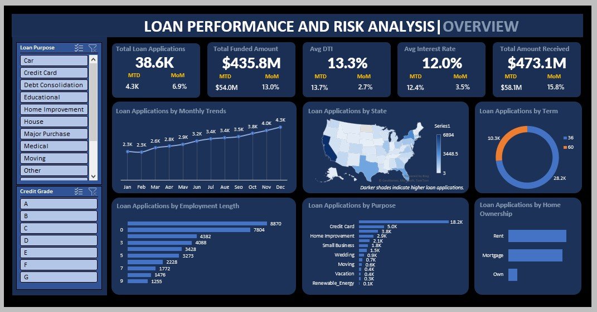

# Bank Loan Performance Dashboard

## Table of Contents
1. [Project Overview](#1-project-overview)
2. [Business Problem](#2-business-problem)
3. [Project Tools](#3-project-tools)
4. [Repository Structure](#4-repository-structure)
5. [Dataset Overview](#5-dataset-overview)
6. [Dashboard Screenshots](#6-dashboard-screenshots)
7. [Methodology](#7-methodology)
8. [Key Insights](#8-key-insights)
9. [Recommendations](#9-recommendations)
10. [Assumptions & Limitations](#10-assumptions--limitations)
11. [Future Enhancements](#11-future-enhancements)
12. [Author](#12-author)

## 1. Project Overview
This project analyzes a bank loan dataset to assess portfolio performance, borrower behavior, and credit risk patterns.The data was cleaned and transformed in Microsoft Excel to support portfolio analysis and the development of key lending metrics, including loan classification into good and bad categories.

An interactive dashboard built with PivotTables enables tracking of loan applications, funded amounts, repayments, and overall portfolio health. The analysis reveals trends and risk indicators that support more informed lending decisions and improved portfolio management.

## 2. Business Problem
Financial institutions often lack a centralized view of loan performance, making it difficult to track growth, monitor repayments, and assess portfolio risk.

This project addresses that gap by developing a Loan Performance Dashboard that provides visibility into loan demand, cash flow, and portfolio quality, enabling stakeholders to evaluate risk and make data-driven lending decisions.

## 3. Project Tools
- **Microsoft Excel**
  - Data cleaning & transformation
  - Excel Tables & PivotTables
  - Pivot Charts & slicers
  - KPI calculations
- **GitHub**
  - Project documentation
  - Version control

## 4. Repository Structure

```text
[Bank-Loan-Performance-Dashboard]/
│
├── dashboard/
│   └── loan_performance_dashboard.xlsx
│
├── data/
│   ├── raw/
│   │   └── bank_loan_raw.csv
│   │
│   └── processed/
│       └── bank_loan_cleaned.xlsx
│
├── docs/
│   ├── business-requirement.md
│   ├── data-dictionary.md
│   └── domain-knowledge.md
│
├── images/
│   ├── overview.jpg
│   ├── summary.jpg
│
├── LICENSE
└── README.md
```

## 5. Dataset Overview

The dataset contains historical loan application and repayment records used to evaluate loan portfolio performance, borrower risk exposure, and repayment behavior.

### Dataset Scope
- Total Records: 38.6K loan applications
- Domain: Consumer Lending / Banking
- Time Granularity: Monthly loan activity
- Primary Analysis Areas:
  - Loan performance monitoring
  - Credit risk assessment
  - Repayment analysis
  - Borrower segmentation
  - Geographic lending trends

### Core Data Components
The dataset includes:
- borrower financial information
- loan application details
- repayment metrics
- loan status classifications
- geographic borrower distribution
- credit risk indicators

> Detailed column definitions and field descriptions are available in the Data Dictionary document located in the `docs/` folder.

## 6. Dashboard Screenshots
### Summary Dashboard


- Provides a high-level view of overall loan portfolio performance, including application volume, funded amount, repayments, and risk indicators.
- Highlights the proportion of good vs bad loans and compares performance metrics across loan statuses.
 
### Overview Dashboard


- Explores loan application trends over time, geographic distribution by state, and borrower characteristics.
- Enables segmentation by loan purpose and credit grade to identify key drivers of loan demand.

## 7. Methodology
### Data Cleaning and Preparation:
The dataset was prepared through the following steps:
- Removed inconsistencies and validated data types across all fields
- Converted text-based columns (loan term, employment length) into numeric formats
- Standardized date fields for time-based analysis
- Handled missing values to ensure dataset completeness
- Structured the cleaned data into Excel Tables for PivotTable analysis
  
### Exploratory Data Analysis
#### Key Performance Indicators (KPIs)
- Total Loan Applications
- Month-to-Date (MTD) Loan Applications
- Month-over-Month (MoM) Application Growth
- Total Funded Amount
- Total Amount Received
- Good Loan Percentage
- Bad Loan Percentage
These KPIs provide visibility into loan demand, cash flow, and overall portfolio health.

#### Good vs Bad Loan Classification
- **Good Loans:** Loans that are fully paid or currently active
- **Bad Loans:** Loans that have been charged off
This classification supports portfolio quality assessment and credit risk evaluation.

## 8. Key Insights

- The loan portfolio demonstrates strong overall health, with 86.2% of loans classified as performing and total repayments exceeding funded amounts.
- Loan applications showed consistent year-over-year growth, increasing from approximately 2.3K in January to 4.3K in December, indicating rising consumer credit demand.
- Non-performing loans account for only 13.8% of total applications but contribute disproportionately to portfolio risk and repayment losses.
- Borrowers associated with charged-off loans exhibit higher average DTI ratios and interest rates, suggesting elevated financial stress within high-risk lending segments.
- Credit card and debt consolidation loans dominate application purposes, indicating strong reliance on refinancing and consumer debt restructuring.
- The majority of borrowers prefer 36-month repayment terms, supporting faster capital recovery and lower long-term default exposure.
- Renters and borrowers with shorter employment tenure represent a significant portion of applicants, highlighting potential exposure to financially less stable borrower groups.
  
## 9. Recommendations

- Strengthen risk assessment models for borrowers with high DTI ratios, shorter employment tenure, and lower credit grades to reduce future charge-offs.
- Reassess pricing strategies for high-risk borrower segments to ensure interest rates adequately compensate for elevated default exposure.
- Expand monitoring of credit card and debt consolidation loans, as heavy concentration in these categories may indicate rising consumer financial stress.
- Implement regional portfolio monitoring to reduce overdependence on high-application geographic markets and improve diversification.
- Introduce targeted retention and repayment support programs for higher-risk borrower groups to improve loan recovery performance.
- Continue promoting shorter-term loan structures, which demonstrate lower long-term repayment risk and healthier cash recovery cycles.
- Enhance borrower segmentation analysis using employment status, home ownership, and credit grade filters to support more precise lending decisions.

## 10. Assumptions & Limitations

### Assumptions
- The dataset provided is assumed to be complete, accurate, and representative of overall loan portfolio activity.
- Loan status classifications such as Fully Paid, Current, and Charged Off are assumed to reflect the latest borrower repayment status.
- Financial metrics including funded amount, repayments, interest rate, and DTI are assumed to be correctly recorded without reporting inconsistencies.
- Monthly trend analysis assumes that historical application patterns are sufficient to evaluate portfolio growth behavior.

### Limitations
- The analysis is limited to the variables available in the dataset and does not include external economic factors such as inflation, unemployment rates, or market interest rate changes.
- Borrower demographic attributes such as income level, age, and occupation were not available for deeper segmentation analysis.
- Geographic analysis is limited to application distribution and does not account for regional economic conditions or default variations.
- The dashboard provides historical and descriptive analysis but does not include predictive modeling or real-time loan monitoring capabilities.
- Insights derived from the dashboard may not fully represent future lending performance due to changing borrower behavior and economic conditions.

## 11. Future Enhancements

- Integrate borrower demographic and income-level data to improve customer segmentation and risk profiling.
- Incorporate predictive analytics models to forecast loan defaults and identify high-risk borrowers earlier in the lending cycle.
- Expand the dashboard with profitability analysis, including interest income, net return, and portfolio yield metrics.
- Add drill-through functionality for deeper analysis across loan purposes, geographic regions, and borrower credit grades.
- Implement time-series forecasting to monitor future loan application trends and repayment performance.
- Introduce automated risk alerts for rising charge-off rates, high DTI segments, and declining repayment behavior.
- Enhance portfolio monitoring with interactive KPI benchmarking across borrower categories and loan performance segments.

## 12. Author
**Godwin Deborah**

Data Analyst
- 🔗 [Linkedin](https://www.linkedin.com/in/godwin-deborah-163b10398/?skipRedirect=true)
- 💼 [GitHub](https://github.com/GodwinDeborah)
- 📧 [Email](mailto:debbiegodwin001@gmail.com)


